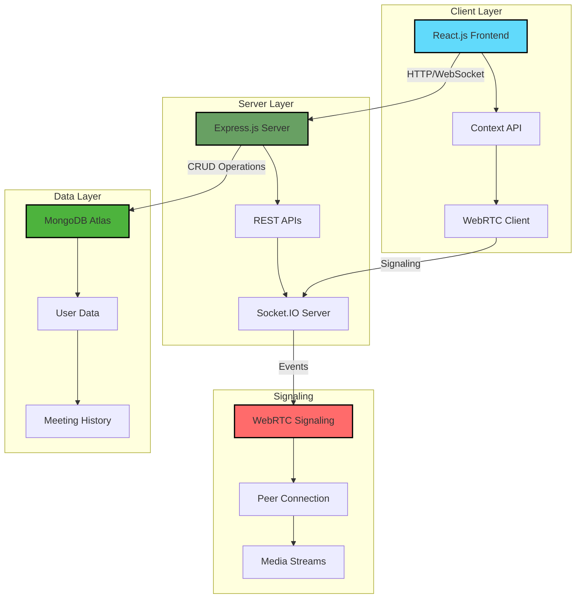

<div align="center">

# 🎥 **JoinIn**

### *Open-Source Video Conferencing Platform Built with MERN + WebRTC*

[](https://github.com/VAMSHIYADAV46/JoinIn)
[](https://github.com/VAMSHIYADAV46/JoinIn/stargazers)
[](https://github.com/VAMSHIYADAV46/JoinIn/commits)
[](https://github.com/VAMSHIYADAV46/JoinIn/issues)
[](LICENSE)

[](https://reactjs.org/)
[](https://nodejs.org/)
[](https://www.mongodb.com/)
[](https://webrtc.org/)
[](https://socket.io/)

[**🚀 Live Demo**](https://joinin-m13s.onrender.com) • [**📖 Documentation**](https://github.com/VAMSHIYADAV46/JoinIn/wiki) • [**🐛 Report Bug**](https://github.com/VAMSHIYADAV46/JoinIn/issues) • [**✨ Request Feature**](https://github.com/VAMSHIYADAV46/JoinIn/issues)

</div>

---

## 🌟 **Introduction**

**JoinIn** is a powerful, open-source video conferencing platform that brings enterprise-grade meeting capabilities to everyone. Built with modern web technologies, it offers seamless real-time communication without the complexity or cost of traditional solutions.

### 🎯 **The Problem**
Most video conferencing solutions are either expensive proprietary software or complex to self-host. Teams need an accessible, privacy-focused platform that they can deploy and customize according to their needs.

### 💡 **Our Solution**
JoinIn combines the power of WebRTC for peer-to-peer communication with the reliability of the MERN stack, creating a fast, secure, and scalable video conferencing solution that you can deploy anywhere.

### 🚀 **What Makes JoinIn Unique**
- **100% Open Source**: Complete transparency and community-driven development
- **Self-Hostable**: Deploy on your infrastructure for complete data control
- **No Installation Required**: Works directly in modern web browsers
- **Customizable**: Modify and extend to fit your specific needs
- **Privacy-First**: Your data stays on your servers

---

## ✨ **Features**

<table>
<tr>
<td width="50%">

### 🎬 **Core Features**
- 📹 **HD Video Conferencing** - Crystal-clear video calls
- 🎤 **Audio Communication** - High-quality voice chat
- 💬 **Real-time Chat** - In-meeting text messaging
- 🔐 **User Authentication** - Secure login system
- 📝 **Meeting History** - Track past meetings
- 👥 **Multiple Participants** - Support for group calls

</td>
<td width="50%">

### 🛡️ **Benefits**
- ⚡ **Lightning Fast** - WebRTC peer-to-peer connection
- 🔒 **Private & Secure** - End-to-end encryption
- 📱 **Responsive Design** - Works on all devices
- 🌍 **Scalable** - Handles multiple concurrent meetings
- 🎨 **Customizable UI** - Adapt to your brand
- 💰 **Cost-Effective** - No licensing fees

</td>
</tr>
</table>

---

## 🏗️ **System Architecture**



---

## 🛠️ **Tech Stack**

| Category | Technology | Description |
|----------|------------|-------------|
| **Frontend** |  | Component-based UI library |
| **State Management** |  | Built-in React state management |
| **Backend** |  | JavaScript runtime |
| **Framework** |  | Web application framework |
| **Database** |  | Cloud NoSQL database |
| **Real-time** |  | Real-time bidirectional communication |
| **Video/Audio** |  | Peer-to-peer media streaming |
| **Deployment** |  | Cloud hosting platform |

---

## 📦 **Installation & Setup**

### **Prerequisites**
- Node.js 16.x or higher
- npm or yarn package manager
- MongoDB Atlas account (free tier available)
- Git installed on your system

### **1️⃣ Clone the Repository**

```bash
git clone https://github.com/VAMSHIYADAV46/JoinIn.git
cd JoinIn
```

### **2️⃣ Backend Setup**

```bash
# Navigate to backend directory
cd backend

# Install dependencies
npm install

# Create environment variables file
touch .env
```

**Configure Backend Environment Variables (.env):**
```env
# Server Configuration
PORT=5000
NODE_ENV=development

# MongoDB Configuration
MONGO_URI=mongodb+srv://<username>:<password>@cluster.mongodb.net/joinin
DB_NAME=joinin

# Session Configuration
SESSION_SECRET=your_super_secret_session_key_here
JWT_SECRET=your_jwt_secret_key_here

# CORS Configuration
CLIENT_URL=http://localhost:3000

# Socket.IO Configuration
SOCKET_PORT=5001
```

**Start the Backend Server:**
```bash
# Development mode
npm run dev

# Production mode
npm start
```

### **3️⃣ Frontend Setup**

```bash
# Open new terminal and navigate to frontend
cd ../frontend

# Install dependencies
npm install

# Create environment variables file
touch .env
```

**Configure Frontend Environment Variables (.env):**
```env
REACT_APP_API_URL=http://localhost:5000
REACT_APP_SOCKET_URL=http://localhost:5001
```

**Start the Frontend Application:**
```bash
# Start development server
npm start

# Build for production
npm run build
```

### **4️⃣ Access the Application**

Open your browser and navigate to:
- Frontend: `http://localhost:3000`
- Backend API: `http://localhost:5000/api`

---

## 💻 **Usage**

### **Demo Credentials**

| Username | Password | Description |
|----------|----------|-------------|
| `demo01` | `12345` | Demo User 1 |
| `demo02` | `12345` | Demo User 2 |

### **Getting Started**

1. **Sign Up/Login**: Create an account or use demo credentials
2. **Create Meeting**: Click "New Meeting" to start a video call
3. **Share Link**: Send the meeting link to participants
4. **Join Meeting**: Participants can join using the link
5. **Collaborate**: Use video, audio, and chat features

### **Screenshots**

<table>
<tr>
<td width="50%">

#### 🏠 **Landing Page**


</td>
<td width="50%">

#### 🔐 **Authentication**


</td>
</tr>
<tr>
<td width="50%">

#### 📹 **Video Call Interface**


</td>
<td width="50%">

#### 💬 **Chat Feature**


</td>
</tr>
</table>

---

## 🚀 **Deployment Guide**

### **Deploy to Render**

#### **Backend Deployment**

1. **Create Backend Service on Render:**
   - Service Type: `Web Service`
   - Build Command: `npm install`
   - Start Command: `npm start`
   - Root Directory: `backend/`

2. **Environment Variables:**
   ```
   PORT=5000
   MONGO_URI=your_mongodb_atlas_connection_string
   SESSION_SECRET=your_session_secret
   JWT_SECRET=your_jwt_secret
   CLIENT_URL=https://your-frontend.onrender.com
   ```

3. **Deploy:**
   - Connect GitHub repository
   - Select branch: `main`
   - Auto-deploy: `Enabled`

#### **Frontend Deployment**

1. **Create Static Site on Render:**
   - Build Command: `npm run build`
   - Publish Directory: `build`
   - Root Directory: `frontend/`

2. **Environment Variables:**
   ```
   REACT_APP_API_URL=https://your-backend.onrender.com
   REACT_APP_SOCKET_URL=https://your-backend.onrender.com
   ```

3. **Deploy:**
   - Connect to same repository
   - Auto-deploy on commits

### **MongoDB Atlas Setup**

1. Create free cluster at [MongoDB Atlas](https://www.mongodb.com/cloud/atlas)
2. Whitelist IP addresses (0.0.0.0/0 for all)
3. Create database user
4. Get connection string
5. Add to backend environment variables

---

## 🗺️ **Roadmap**

### **Phase 1: Core Features** ✅
- [x] Video/Audio calling
- [x] Real-time chat
- [x] User authentication
- [x] Basic UI/UX

### **Phase 2: Enhanced Features** 🚧
- [ ] Screen sharing capability
- [ ] Meeting recording
- [ ] Virtual backgrounds
- [ ] Participant management
- [ ] Meeting scheduler

### **Phase 3: Advanced Features** 📋
- [ ] Unique meeting links generation
- [ ] Email invitations system
- [ ] Calendar integration
- [ ] Breakout rooms
- [ ] Polls and Q&A

### **Phase 4: Scaling & Performance** 🎯
- [ ] TURN server integration
- [ ] Load balancing
- [ ] Horizontal scaling
- [ ] CDN integration
- [ ] Analytics dashboard

### **Phase 5: Enterprise Features** 🏢
- [ ] SSO integration
- [ ] Advanced security features
- [ ] Custom branding options
- [ ] API for third-party integrations
- [ ] Compliance certifications

---

## 🤝 **Contributing**

We welcome contributions from the community! Here's how you can help:

### **How to Contribute**

1. **Fork the Repository**
   ```bash
   git clone https://github.com/YOUR_USERNAME/JoinIn.git
   cd JoinIn
   ```

2. **Create Feature Branch**
   ```bash
   git checkout -b feature/AmazingFeature
   ```

3. **Make Your Changes**
   - Follow the existing code style
   - Write meaningful commit messages
   - Add tests for new features
   - Update documentation

4. **Commit Your Changes**
   ```bash
   git add .
   git commit -m "✨ Add AmazingFeature"
   ```

5. **Push to Your Fork**
   ```bash
   git push origin feature/AmazingFeature
   ```

6. **Open Pull Request**
   - Provide clear description
   - Link related issues
   - Include screenshots/demos

### **Development Guidelines**

- **Code Style**: Follow ESLint configuration
- **Testing**: Write unit tests for new features
- **Documentation**: Update README for new features
- **Performance**: Optimize for real-time performance

---

## 📄 **License**

This project is licensed under the MIT License - see the [LICENSE](LICENSE) file for details.

```
MIT License

Copyright (c) 2024 Mekala Vamshi Yadav

Permission is hereby granted, free of charge, to any person obtaining a copy
of this software and associated documentation files (the "Software"), to deal
in the Software without restriction...
```

---

## 🙏 **Acknowledgements**

### **Special Thanks To:**

- 🌐 [**WebRTC**](https://webrtc.org/) - For peer-to-peer communication technology
- 🔌 [**Socket.IO**](https://socket.io/) - For real-time bidirectional event-based communication
- 🚀 [**Render**](https://render.com/) - For seamless deployment platform
- 🍃 [**MongoDB Atlas**](https://www.mongodb.com/cloud/atlas) - For cloud database hosting
- ⚛️ [**React Team**](https://reactjs.org/) - For the amazing frontend framework
- 🟢 [**Node.js Community**](https://nodejs.org/) - For the robust backend runtime
- 👥 All contributors and the open-source community

### **Inspired By:**
- Zoom - For setting the standard in video conferencing
- Jitsi Meet - For pioneering open-source video calls
- Google Meet - For simplicity and accessibility

---

## 👨‍💻 **Author**

<div align="center">

### **Mekala Vamshi Yadav**
*Full-Stack Developer & Open Source Enthusiast*

[](https://github.com/VAMSHIYADAV46)
[](https://linkedin.com/in/mekalavamshiyadav)
[](https://vamshiyadav.dev)

</div>

---

## 🔗 **Project Links**

- 🌐 **Repository**: [https://github.com/VAMSHIYADAV46/JoinIn](https://github.com/VAMSHIYADAV46/JoinIn)
- 📖 **Documentation**: [https://github.com/VAMSHIYADAV46/JoinIn/wiki](https://github.com/VAMSHIYADAV46/JoinIn/wiki)
- 🐛 **Issue Tracker**: [https://github.com/VAMSHIYADAV46/JoinIn/issues](https://github.com/VAMSHIYADAV46/JoinIn/issues)
- 💬 **Discussions**: [https://github.com/VAMSHIYADAV46/JoinIn/discussions](https://github.com/VAMSHIYADAV46/JoinIn/discussions)
- 🚀 **Live Demo**: [https://joinin.demo.com](https://joinin.demo.com)

---

<div align="center">

### ⭐ **Star this repo if you find it helpful!**


**Built with ❤️ by the Open Source Community**

</div>
